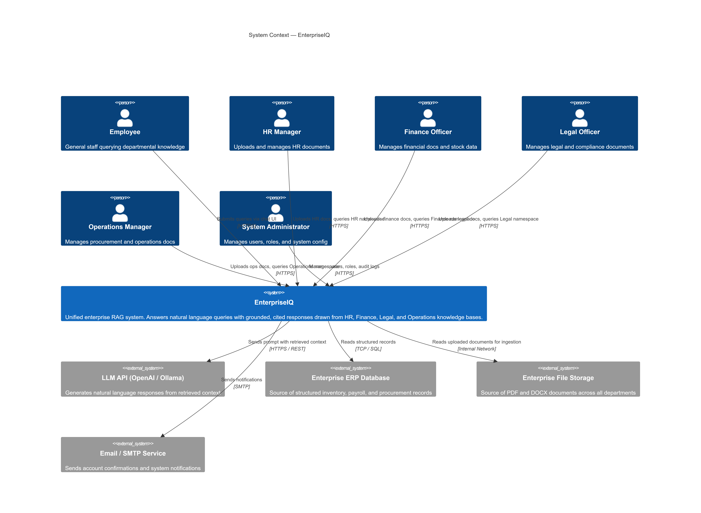
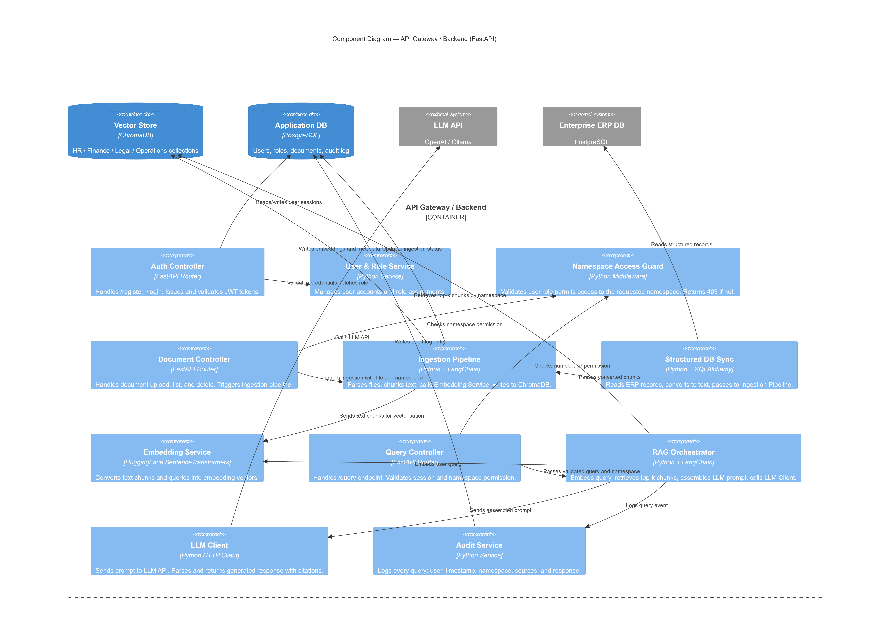
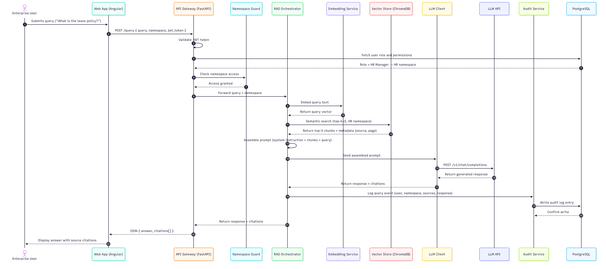

# ARCHITECTURE.md

# EnterpriseIQ — Architectural Design Document

---

## 1. Introduction

### 1.1 Project Title
**EnterpriseIQ: An Intelligent Retrieval-Augmented Generation System for Enterprise Knowledge Management**

### 1.2 Domain
**Large-Scale Enterprise Operations & Knowledge Management**

This document describes the complete architectural design of EnterpriseIQ using the **C4 Model** — a structured approach to visualising software architecture at four levels of abstraction:

| Level | Name | Purpose |
|---|---|---|
| L1 | System Context | Who uses the system and what external systems it integrates with |
| L2 | Container Diagram | The major deployable units (apps, databases, services) |
| L3 | Component Diagram | The internal building blocks within the API backend |
| L4 | Sequence Diagram | The runtime flow of a complete end-to-end RAG query |

---

## 2. C4 Level 1 — System Context Diagram

> Shows EnterpriseIQ as a black box. Identifies all human users (actors) and external systems that interact with it.

### Description

EnterpriseIQ serves six user roles across the enterprise: general Employees, HR Managers, Finance Officers, Legal Officers, Operations Managers, and a System Administrator. It integrates with four external systems: an LLM API for response generation, the Enterprise ERP Database for structured records, Enterprise File Storage for documents, and an Email/SMTP service for notifications.

### Diagram

---

## 3. C4 Level 2 — Container Diagram

> Zooms into EnterpriseIQ and shows the major deployable containers — applications, databases, and services — and how they communicate.

### Description

EnterpriseIQ is composed of seven containers: a Angular Web Application for the user interface, a FastAPI Gateway handling all requests and orchestration, a Document Ingestion Service for parsing and embedding documents, a RAG Service for retrieval and LLM response generation, a Structured Data Connector for ERP database sync, a ChromaDB Vector Store holding namespace-isolated embeddings, and a PostgreSQL Application Database storing users, metadata, and audit logs.

### Diagram

---

## 4. C4 Level 3 — Component Diagram

> Zooms into the API Gateway / Backend and shows its internal components — the individual modules that make up the system's core logic.

### Description

The API Gateway is composed of eleven components: Auth Controller, User & Role Service, Namespace Access Guard, Document Controller, Ingestion Pipeline, Structured DB Sync, Embedding Service, Query Controller, RAG Orchestrator, LLM Client, and Audit Service. Together these components handle authentication, role enforcement, document processing, semantic retrieval, response generation, and compliance logging.

### Diagram

---

## 5. C4 Level 4 — Sequence Diagram (End-to-End RAG Query Flow)

> Shows the dynamic runtime sequence of a complete end-to-end query — from an employee submitting a natural language question to receiving a grounded, cited LLM response.

### Description

The sequence covers 22 steps: the user submits a query via the Angular UI → the API Gateway validates the JWT token and fetches the user's role from PostgreSQL → the Namespace Guard confirms access → the RAG Orchestrator embeds the query → ChromaDB returns the top-5 relevant chunks → the prompt is assembled and sent to the LLM API → the generated response is returned with citations → the Audit Service logs the full event → the cited answer is displayed to the user.

### Diagram

---

## 6. End-to-End Component Summary

The table below maps every system component to its role in the end-to-end flow, confirming full coverage from user input to stored audit record.

| Layer | Component | Role in System |
|---|---|---|
| Presentation | Angular Web App | Chat UI, document dashboard, audit log viewer |
| API | FastAPI Gateway | Request routing, auth enforcement, orchestration |
| Security | Auth Controller + Namespace Guard | JWT validation, RBAC enforcement per namespace |
| Ingestion | Ingestion Pipeline + DB Sync | PDF/DOCX parsing, ERP extraction, chunking |
| Embedding | Embedding Service (HuggingFace) | Text → vector conversion for chunks and queries |
| Storage | ChromaDB Vector Store | Namespace-isolated semantic similarity search |
| Storage | PostgreSQL App DB | Users, roles, document metadata, audit log |
| Retrieval | RAG Orchestrator | Query embedding, top-k retrieval, prompt assembly |
| Generation | LLM Client + LLM API | Grounded response generation with inline citations |
| Compliance | Audit Service | Full query-to-response event logging |
| External | Enterprise ERP DB | Source of inventory, payroll, procurement records |
| External | File Storage | Source of PDF and DOCX enterprise documents |

---