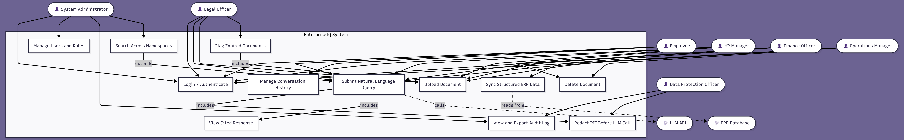

# EnterpriseIQ - Use Case Modeling Document

---

## 1. Use Case Diagram

---

## 2. Written Explanation

### 2.1 Key Actors and Their Roles

| Actor | Role in the System |
|---|---|
| **Employee** | General staff who log in and submit natural language queries to retrieve departmental knowledge |
| **HR Manager** | Uploads and manages HR documents; queries the HR namespace; deletes outdated documents |
| **Finance Officer** | Manages financial documents and triggers ERP sync for live stock and inventory data |
| **Legal Officer** | Uploads legal documents; monitors expiring compliance documents; queries Legal namespace |
| **Operations Manager** | Manages procurement and supplier documents; queries Operations namespace |
| **System Administrator** | Manages all user accounts and roles; views and exports the audit log; can query across all namespaces |
| **Data Protection Officer** | Monitors audit logs for compliance; ensures PII redaction is functioning correctly |
| **LLM API** | External system — receives assembled prompts and returns generated responses (actor in automated flows) |
| **ERP Database** | External system — source of structured inventory and procurement records for sync |

---

### 2.2 Relationships Between Actors and Use Cases

**Inclusion relationships (<<include>>):**
- `Submit Natural Language Query` **includes** `Redact PII Before LLM Call` — every query must pass through PII redaction before being sent to the LLM. This relationship is mandatory, not optional.
- `Submit Natural Language Query` **includes** `View Cited Response` — a query always produces a cited response; they are inseparable.
- `Flag Expired Documents` **includes** `Upload Document` — the expiry flagging system is only triggered when a document exists in the system.

**Extension relationships (<<extend>>):**
- `Search Across Namespaces` **extends** `Submit Natural Language Query` — Administrators can optionally extend a standard query to span all department namespaces, which general users cannot do.

**Generalisation:**
- HR Manager, Finance Officer, Legal Officer, and Operations Manager all generalise from the base Employee actor — they inherit the ability to log in and submit queries, and add department-specific capabilities such as document upload and deletion.

---

### 2.3 How the Diagram Addresses Stakeholder Concerns

- **Employee concern** (fast, accurate answers): `Submit Natural Language Query` → `View Cited Response` directly addresses this — employees interact with these two use cases on every session.
- **HR Manager concern** (only approved documents accessible): `Upload Document` and `Delete Document` give HR Managers governance over what enters the HR namespace.
- **Legal Officer concern** (expired policy detection): `Flag Expired Documents` was added specifically to address the Legal Officer's pain point of manually tracking document review dates.
- **Finance Officer concern** (live stock data): `Sync Structured ERP Data` ensures inventory records are regularly pulled from the ERP and made queryable.
- **System Administrator concern** (auditable access): `Manage Users and Roles` and `View and Export Audit Log` give the Admin full visibility and control.
- **DPO concern** (PII protection): `Redact PII Before LLM Call` is a mandatory include on every query, ensuring no personal data is transmitted to external services without redaction.

---

## 3. Use Case Specifications

---

### UC-01: Login / Authenticate

| Field | Detail |
|---|---|
| **Use Case ID** | UC-01 |
| **Use Case Name** | Login / Authenticate |
| **Actor(s)** | All users (Employee, HR Manager, Finance Officer, Legal Officer, Operations Manager, System Administrator, DPO) |
| **Description** | Allows a registered user to authenticate into EnterpriseIQ using their corporate email and password, receiving a JWT session token granting access to their permitted namespaces. |
| **Preconditions** | The user has a registered account in the system. The system is online and accessible. |
| **Postconditions** | The user is authenticated. A JWT token is issued and stored in the browser session. The user is redirected to their department dashboard. |

**Basic Flow:**
1. User navigates to the EnterpriseIQ login page.
2. User enters their corporate email address and password.
3. System validates credentials against the application database.
4. System generates a signed JWT token containing the user's ID and role.
5. System redirects the user to their role-appropriate dashboard.

**Alternative Flows:**
- **A1 — Invalid credentials:** System returns "Invalid email or password" without specifying which field is incorrect. Login attempt is logged.
- **A2 — Account locked:** After 5 consecutive failed attempts, system locks the account and displays "Account locked. Contact your administrator."
- **A3 — Expired session:** If the user's token has expired, they are redirected to the login page with a message "Your session has expired. Please log in again."

---

### UC-02: Submit Natural Language Query

| Field | Detail |
|---|---|
| **Use Case ID** | UC-02 |
| **Use Case Name** | Submit Natural Language Query |
| **Actor(s)** | Employee, HR Manager, Finance Officer, Legal Officer, Operations Manager |
| **Description** | Allows an authenticated user to type a natural language question into the chat interface. The system retrieves relevant document chunks from the user's permitted namespace, assembles a prompt, calls the LLM API, and returns a grounded, cited response. Includes UC-11 (Redact PII) and UC-03 (View Cited Response). |
| **Preconditions** | The user is authenticated (UC-01 completed). At least one document has been ingested into the user's namespace. |
| **Postconditions** | A grounded LLM response with inline citations is displayed in the chat interface. The query event is logged in the audit trail. |

**Basic Flow:**
1. User types a natural language query into the chat input field and submits.
2. System passes the query text through the PII redaction module (UC-11).
3. System embeds the (redacted) query into a vector.
4. System performs semantic similarity search against the user's permitted namespace in ChromaDB, retrieving the top-5 chunks.
5. System assembles a structured LLM prompt: system instruction + retrieved chunks + user query.
6. System sends the prompt to the LLM API and awaits response.
7. LLM returns a generated response with citation markers.
8. System displays the response in the chat interface with inline citations (UC-03).
9. Audit service logs the full query event.

**Alternative Flows:**
- **A1 — No relevant chunks found:** System skips LLM call and displays "No relevant information found in your knowledge base."
- **A2 — LLM API timeout:** System displays "The response service is temporarily unavailable. Please try again." Query is still logged.
- **A3 — Empty query submitted:** System displays "Please enter a question before submitting." No API calls are made.

---

### UC-03: View Cited Response

| Field | Detail |
|---|---|
| **Use Case ID** | UC-03 |
| **Use Case Name** | View Cited Response |
| **Actor(s)** | Employee, HR Manager, Finance Officer, Legal Officer, Operations Manager |
| **Description** | After a query is processed, the system displays the LLM-generated response alongside an expandable panel showing the source document chunks used to generate the answer. |
| **Preconditions** | UC-02 has completed successfully and a response has been generated. |
| **Postconditions** | The user has viewed the response and optionally expanded the source panel to review the underlying document passages. |

**Basic Flow:**
1. System displays the LLM-generated answer text in the chat interface.
2. Below the answer, a collapsed "Sources" panel shows the number of documents referenced (e.g., "3 sources used").
3. User clicks the "Sources" panel to expand it.
4. System displays each retrieved chunk with: document name, page number, and the exact passage text.
5. User reads the source passages to verify the answer.

**Alternative Flows:**
- **A1 — User does not expand sources:** The response is displayed and the session continues. No sources are shown unless the user explicitly expands the panel.
- **A2 — Source document has been deleted:** System displays the chunk text and metadata but notes "Source document has been removed from the knowledge base."

---

### UC-04: Upload Document

| Field | Detail |
|---|---|
| **Use Case ID** | UC-04 |
| **Use Case Name** | Upload Document |
| **Actor(s)** | HR Manager, Finance Officer, Legal Officer, Operations Manager |
| **Description** | Allows an authorised department manager to upload a PDF or DOCX document to their department namespace. The system validates the file, triggers the ingestion pipeline, and tracks ingestion status. |
| **Preconditions** | The user is authenticated and has a Manager-level role. The document is in PDF or DOCX format and is under the maximum file size limit (50MB). |
| **Postconditions** | The document is ingested, chunked, embedded, and stored in the vector store under the correct namespace. Ingestion status is set to "Ready." |

**Basic Flow:**
1. Manager navigates to the Document Management dashboard.
2. Manager clicks "Upload Document" and selects a file from their local machine.
3. System validates the file format (PDF or DOCX) and size (≤ 50MB).
4. System sets the document's ingestion status to "Pending" and displays it in the dashboard.
5. System triggers the ingestion pipeline asynchronously.
6. Ingestion pipeline parses the document, chunks text, generates embeddings, and writes to ChromaDB.
7. System updates the document status to "Ready."
8. Manager receives a success notification.

**Alternative Flows:**
- **A1 — Unsupported file format:** System rejects the upload and displays "Only PDF and DOCX files are supported."
- **A2 — File too large:** System rejects the upload and displays "File exceeds the 50MB limit."
- **A3 — Ingestion fails:** Status is set to "Failed." Manager receives an error notification with a description of the failure.

---

### UC-05: Manage Users and Roles

| Field | Detail |
|---|---|
| **Use Case ID** | UC-05 |
| **Use Case Name** | Manage Users and Roles |
| **Actor(s)** | System Administrator |
| **Description** | Allows the System Administrator to create, update, deactivate, and delete user accounts and assign or modify role assignments, controlling what namespaces each user can access. |
| **Preconditions** | The System Administrator is authenticated. |
| **Postconditions** | The user account is created/updated/deactivated/deleted. Role changes take effect within 60 seconds without requiring the affected user to log out. |

**Basic Flow:**
1. Administrator navigates to the User Management dashboard.
2. Administrator selects an action: Create User, Edit User, Deactivate User, or Delete User.
3. For Create: Administrator enters name, corporate email, and assigns a role. System sends a registration confirmation email.
4. For Edit: Administrator updates role or account details. System saves changes and propagates to active sessions within 60 seconds.
5. For Deactivate: Administrator confirms deactivation. System immediately invalidates the user's active JWT token.
6. For Delete: Administrator confirms deletion. System removes the user account and all associated session data.

**Alternative Flows:**
- **A1 — Email already registered:** System displays "An account with this email already exists."
- **A2 — Deactivating own account:** System prevents self-deactivation and displays "You cannot deactivate your own account."

---

### UC-06: Sync Structured ERP Data

| Field | Detail |
|---|---|
| **Use Case ID** | UC-06 |
| **Use Case Name** | Sync Structured ERP Data |
| **Actor(s)** | Finance Officer, Operations Manager (manual trigger); System (scheduled automatic trigger) |
| **Description** | Reads structured records from the enterprise ERP PostgreSQL database (inventory, procurement, payroll) and ingests them as queryable text chunks into the appropriate namespace in the vector store. |
| **Preconditions** | A valid connection to the enterprise ERP database is configured. The Finance or Operations namespace exists in the vector store. |
| **Postconditions** | ERP records are converted to text chunks, embedded, and stored in the vector store with a sync timestamp. Previous versions of the same records are replaced. |

**Basic Flow:**
1. System scheduler triggers the sync job (default: every 60 minutes), or a Finance/Operations Manager manually triggers it from the dashboard.
2. DB Sync connector connects to the ERP PostgreSQL database.
3. Connector reads updated records from configured tables (inventory, procurement, payroll).
4. Connector converts each record row into a structured text chunk with metadata.
5. Ingestion pipeline generates embeddings for each chunk.
6. Vector store updates existing chunks for changed records and adds new chunks for new records.
7. Sync timestamp is recorded and displayed in the dashboard.

**Alternative Flows:**
- **A1 — ERP database unreachable:** Sync job fails. System Administrator receives an alert. Previous embeddings remain in place. Timestamp shows last successful sync.
- **A2 — No new records since last sync:** Sync completes with a "No new records" status. Timestamp is updated.

---

### UC-07: View and Export Audit Log

| Field | Detail |
|---|---|
| **Use Case ID** | UC-07 |
| **Use Case Name** | View and Export Audit Log |
| **Actor(s)** | System Administrator, Data Protection Officer |
| **Description** | Allows authorised users to view the full audit log of all query events in the system, filter by user, namespace, or date range, and export the log as a CSV file for compliance reporting. |
| **Preconditions** | The user is authenticated with Administrator or DPO role. |
| **Postconditions** | The user has viewed or exported the filtered audit log. No log entries are modified during this process. |

**Basic Flow:**
1. Administrator or DPO navigates to the Audit Log dashboard.
2. System displays a paginated table of all query events: user ID, timestamp, namespace, query text, sources retrieved, response summary.
3. User applies filters (by user, namespace, date range).
4. System updates the table to show matching entries.
5. User clicks "Export CSV."
6. System generates and downloads a CSV file of the filtered results.

**Alternative Flows:**
- **A1 — No results match the filter:** System displays "No audit records found for the selected filters."
- **A2 — Export fails:** System displays "Export failed. Please try again." The on-screen table remains accessible.

---

### UC-08: Flag Expired Documents

| Field | Detail |
|---|---|
| **Use Case ID** | UC-08 |
| **Use Case Name** | Flag Expired Documents |
| **Actor(s)** | System (automated), Legal Officer |
| **Description** | The system automatically checks all documents in the Legal namespace for documents that have not been reviewed within the configured expiry threshold (default: 12 months). Flagged documents are highlighted in the dashboard and notification emails are sent to the Legal Officer. |
| **Preconditions** | At least one document exists in the Legal namespace with a recorded upload or last-reviewed date. The expiry threshold is configured in the system settings. |
| **Postconditions** | Documents past the expiry threshold are flagged with a warning indicator. Email notifications are sent to the Legal Officer at 30 days and 7 days before threshold breach. |

**Basic Flow:**
1. System scheduler runs the document expiry check daily.
2. System retrieves all documents in the Legal namespace and compares their last-reviewed date against the configured threshold.
3. Documents within 30 days of expiry are marked with a yellow "Review Soon" indicator.
4. Documents within 7 days of expiry are marked with a red "Urgent Review" indicator.
5. System sends an email notification to the Legal Officer listing the flagged documents.
6. Legal Officer logs into the dashboard and reviews flagged documents.
7. Legal Officer updates the document's last-reviewed date after completing review, clearing the flag.

**Alternative Flows:**
- **A1 — Email service unavailable:** Flag is still set in the dashboard. A system log entry records the failed notification. Alert is retried the following day.
- **A2 — No documents near expiry:** Check completes silently with no flags set and no notification sent.
