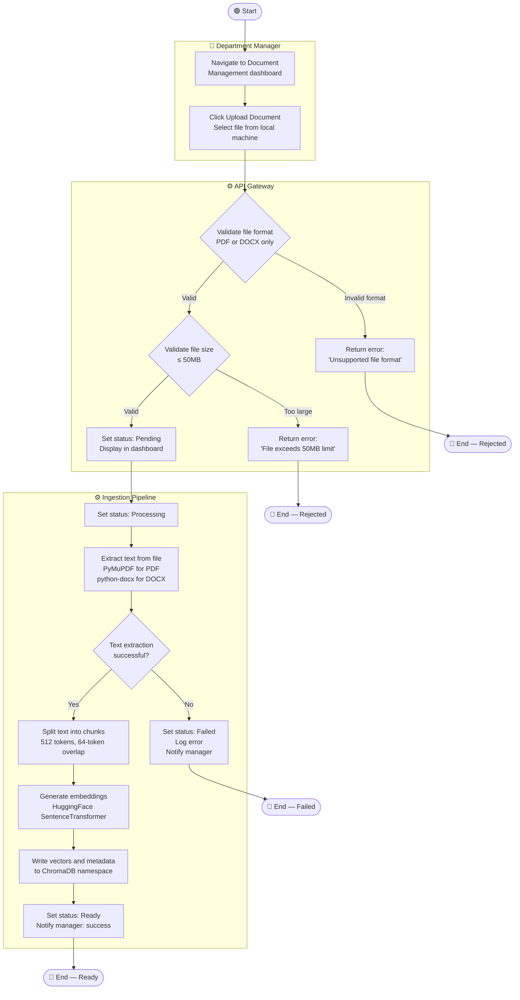
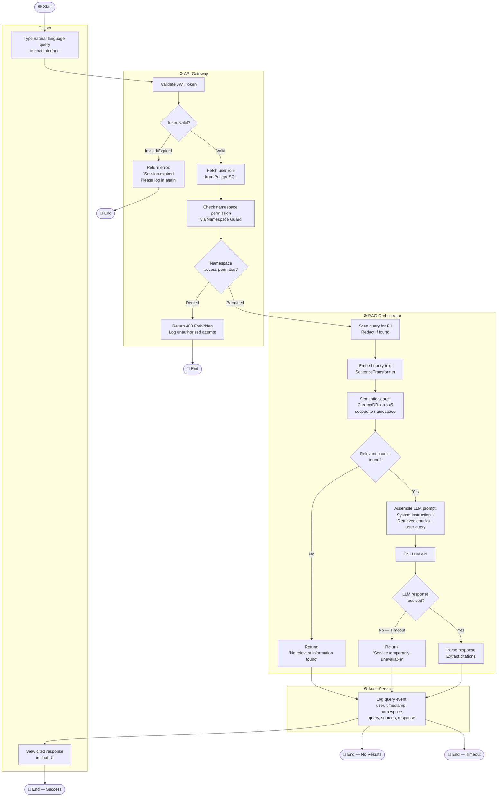
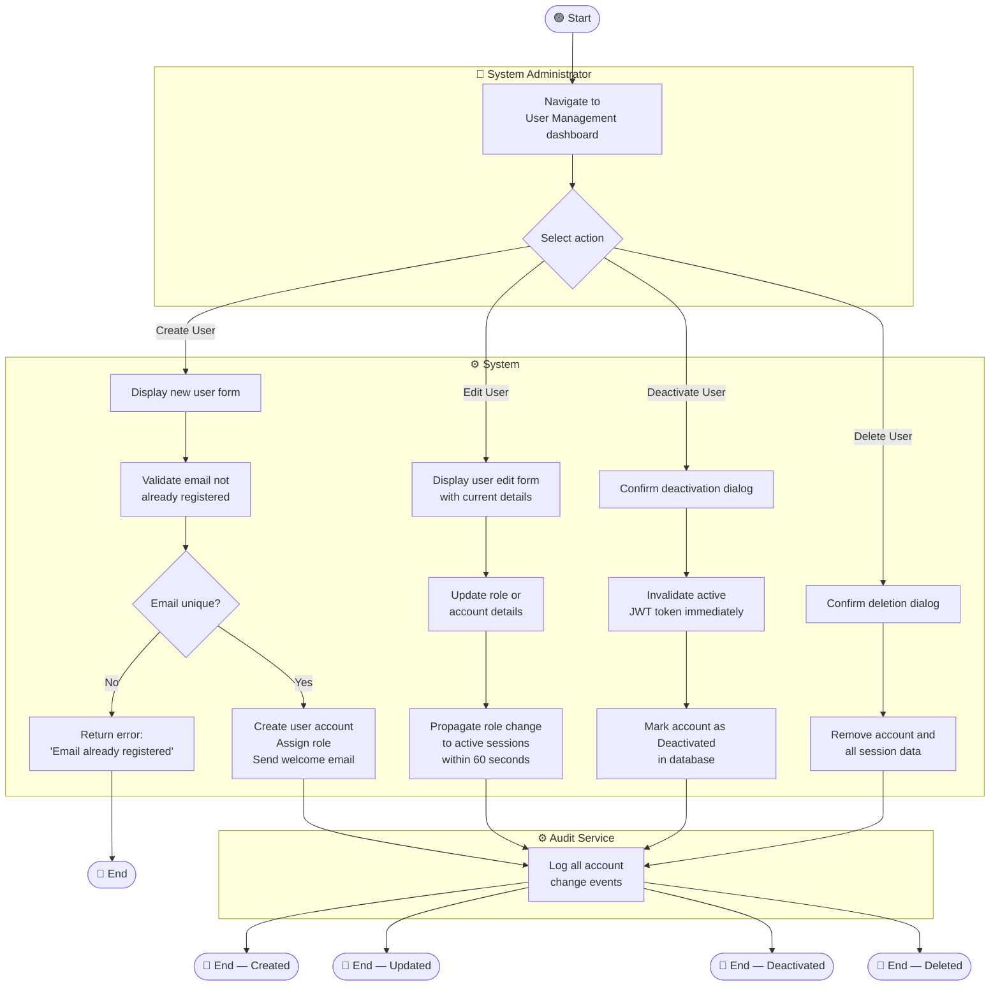
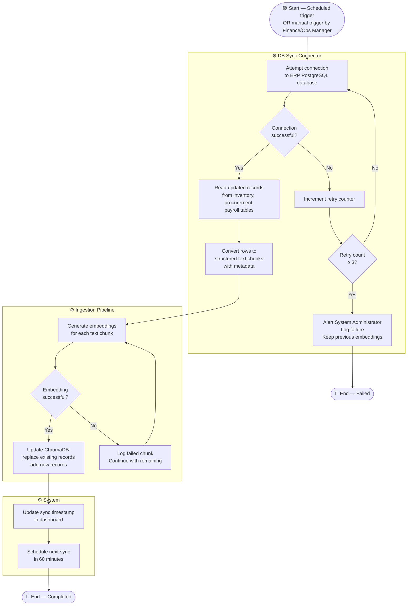
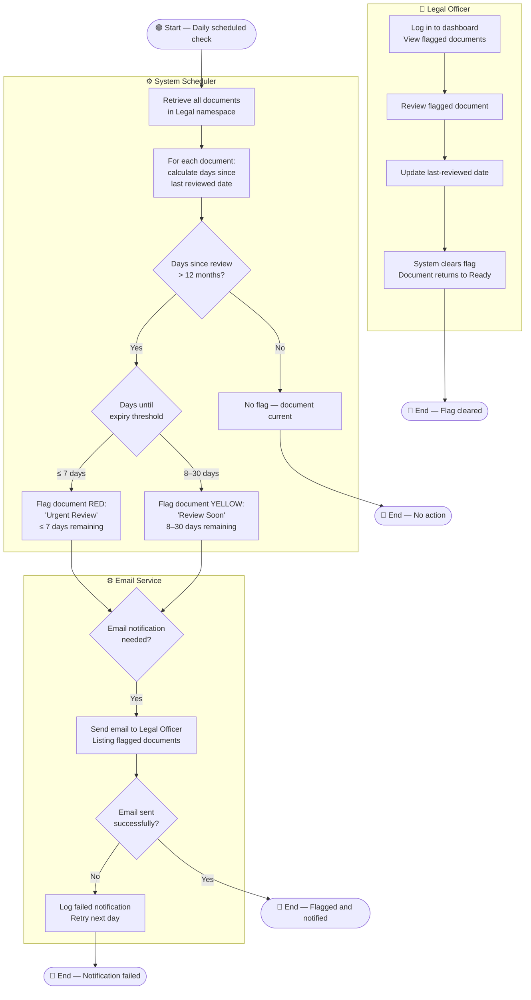
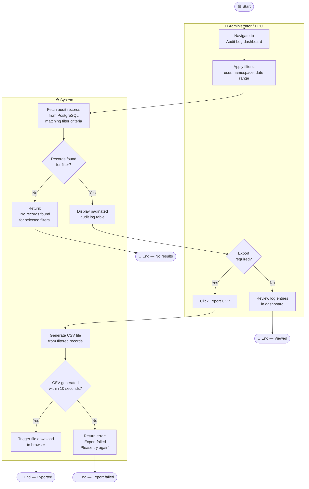
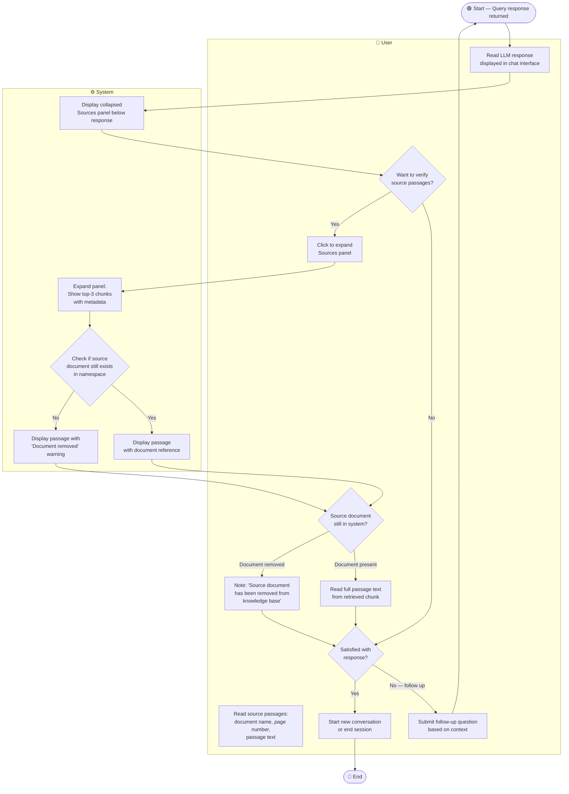

# activity_diagrams.md

# EnterpriseIQ - Activity Workflow Modeling

---

## Overview

Model of 8 complex workflows in EnterpriseIQ using UML activity diagrams rendered in Mermaid. Each diagram includes start/end nodes, actions, decision branches, parallel actions, and swimlanes identifying the actor responsible for each step. All diagrams are traceable to functional requirements in `SRD.md` and use cases in `USECASES.md`.

---

## Workflow 1: SSO User Authentication

```mermaid
flowchart TD
    Start([🟢 Start]) --> A

    subgraph User["👤 User"]
        A[Navigate to EnterpriseIQ login page]
        B[Click 'Login with SSO']
        C[Enter corporate credentials\nin SSO provider portal]
    end

    subgraph System["⚙️ System"]
        D{SSO provider\nvalidates credentials}
        E[Receive SSO token\nfrom provider]
        F{Does user account\nexist in system?}
        G[Auto-provision new account\nAssign default Employee role]
        H[Load existing account\nand role assignment]
        I[Generate signed JWT token]
        J[Redirect user to\ndepartment dashboard]
        K[Return error message:\n'Authentication failed']
        L[Increment failed\nattempt counter]
        M{Failed attempts\n≥ 5?}
        N[Lock account\nNotify administrator]
    end

    A --> B --> C --> D
    D -->|Valid| E --> F
    F -->|No — first login| G --> I
    F -->|Yes — returning user| H --> I
    I --> J --> End1([🔴 End — Authenticated])

    D -->|Invalid| L --> M
    M -->|No| K --> End2([🔴 End — Failed])
    M -->|Yes| N --> End3([🔴 End — Account Locked])
```

**Explanation:**
This workflow covers the complete SSO authentication flow. The decision at "Does user account exist?" handles both first-time and returning users — a key requirement since SSO auto-provisions accounts rather than requiring manual registration. Parallel to the happy path, the failure branch tracks consecutive failures and locks the account after 5 attempts. This addresses stakeholder concerns from the **System Administrator** (auditable access) and **DPO** (secure authentication). Maps to **FR-01**, **US-001**, **UC-01**.

---

## Workflow 2: Document Upload and Ingestion

**Explanation:**
Two validation gates (format and size) protect the ingestion pipeline from invalid inputs before any processing begins. The pipeline is modelled as a separate swimlane to reflect that it runs asynchronously after the API responds. The status updates (Pending → Processing → Ready/Failed) are visible to the manager in real time on the dashboard. Maps to **FR-03**, **FR-11**, **US-003**, **UC-04**. Addresses the **HR Manager** concern that only valid, approved documents enter the knowledge base.

---

## Workflow 3: Natural Language Query (RAG Pipeline)

**Explanation:**
This is the most critical workflow in EnterpriseIQ — the complete RAG query pipeline. It covers 5 possible outcomes: expired session, unauthorised namespace access, no results found, LLM timeout, and successful cited response. PII redaction is built into the pipeline before embedding, ensuring compliance. The audit log write occurs in all outcomes — even failures are logged. Maps to **FR-05**, **FR-09**, **FR-12**, **US-004**, **US-009**, **UC-02**. Addresses concerns from all end-user stakeholders and the **DPO**.

---

## Workflow 4: Admin Manages User Accounts and Roles

**Explanation:**
Four distinct branches from a single decision point model the four user management actions. The deactivation branch immediately invalidates the JWT token — a security requirement ensuring no delay between the admin action and loss of access. Role changes propagate to active sessions within 60 seconds without requiring logout. Maps to **FR-02**, **US-002**, **UC-05**. Directly addresses **System Administrator** concerns about auditable, rapid account control.

---

## Workflow 5: ERP Structured Data Sync

**Explanation:**
The retry loop (up to 3 attempts) prevents a transient network issue from causing a permanent sync failure. The partial failure path (failed chunk logged, pipeline continues) ensures that one bad record does not block all other records from being updated. The sync timestamp visible in the Finance dashboard addresses the **Finance Officer** stakeholder concern about knowing how current the stock data is. Maps to **FR-04**, **US-006**, **UC-06**.

---

## Workflow 6: Document Expiry Flagging (Legal Namespace)

**Explanation:**
The daily check iterates over all Legal namespace documents and applies a two-tier flagging system — yellow for approaching expiry and red for urgent review. The email notification path has its own failure handling to ensure a failed email does not prevent the flag from being set on the dashboard. The Legal Officer's response (reviewing and updating the date) closes the loop. Maps to **FR-07**, **US-007**, **UC-08**. Addresses the **Legal Officer** concern about missing regulatory deadlines.

---

## Workflow 7: Audit Log View and Export

**Explanation:**
The filter-first approach means administrators never download unfiltered data — reducing the risk of exporting more personal data than necessary, a key concern for the **DPO**. The 10-second CSV generation guard addresses the performance NFR. Log entries are read-only — there is no delete or edit path in this workflow, enforcing immutability. Maps to **FR-09**, **US-008**, **UC-07**. Addresses **System Administrator** and **DPO** compliance concerns.

---

## Workflow 8: View Cited Response and Source Passages

**Explanation:**
The Sources panel is collapsed by default to keep the interface clean for general employees, but expands on demand for users like Legal Officers who need to verify the underlying passages. The document-removed warning prevents confusion when a manager deletes a document after it has already been queried. The follow-up loop reflects the multi-turn conversation capability from FR-08. Maps to **FR-06**, **FR-08**, **US-005**, **US-010**, **UC-03**. Addresses **Legal Officer** and **Employee** concerns about response accuracy and verification.
