# class_diagram.md

# EnterpriseIQ - Class Diagram

---

## 1. Full Class Diagram

```mermaid
classDiagram

    %% ─────────────────────────────────────────
    %% ENUMERATIONS
    %% ─────────────────────────────────────────

    class Role {
        <<enumeration>>
        EMPLOYEE
        HR_MANAGER
        FINANCE_OFFICER
        LEGAL_OFFICER
        OPS_MANAGER
        ADMIN
    }

    class AccountStatus {
        <<enumeration>>
        PENDING
        ACTIVE
        LOCKED
        DEACTIVATED
        DELETED
    }

    class DocumentStatus {
        <<enumeration>>
        UPLOADED
        PENDING
        PROCESSING
        READY
        FAILED
        FLAGGED
        DELETED
    }

    class NamespaceId {
        <<enumeration>>
        HR
        FINANCE
        LEGAL
        OPERATIONS
    }

    class TokenStatus {
        <<enumeration>>
        ISSUED
        ACTIVE
        EXPIRED
        REVOKED
    }

    class QueryStatus {
        <<enumeration>>
        INITIATED
        SCANNING
        EMBEDDING
        RETRIEVING
        GENERATING
        COMPLETED
        FAILED
    }

    %% ─────────────────────────────────────────
    %% CORE CLASSES
    %% ─────────────────────────────────────────

    class UserAccount {
        -userId : String
        -email : String
        -role : Role
        -status : AccountStatus
        -failedLoginAttempts : Integer
        -createdAt : DateTime
        -lastLoginAt : DateTime
        +login() void
        +logout() void
        +submitQuery(text: String) QuerySession
        +uploadDocument(file: File, namespace: NamespaceId) Document
        +deleteDocument(documentId: String) void
        +getPermittedNamespaces() List~NamespaceId~
        +lockAccount() void
        +unlockAccount() void
    }

    class JWTToken {
        -tokenId : String
        -userId : String
        -role : Role
        -issuedAt : DateTime
        -expiresAt : DateTime
        -status : TokenStatus
        +validate() Boolean
        +revoke() void
        +getClaims() Map~String, Object~
        +isExpired() Boolean
    }

    class Document {
        -documentId : String
        -fileName : String
        -fileType : String
        -fileSizeBytes : Long
        -namespace : NamespaceId
        -status : DocumentStatus
        -uploadedBy : String
        -uploadedAt : DateTime
        -lastReviewedAt : DateTime
        -ingestionError : String
        +validate() Boolean
        +startIngestion() void
        +markReviewed() void
        +isExpired() Boolean
        +delete() void
    }

    class VectorEmbedding {
        -embeddingId : String
        -documentId : String
        -namespace : NamespaceId
        -chunkText : String
        -chunkIndex : Integer
        -pageNumber : Integer
        -vector : Float[]
        -createdAt : DateTime
        -isStale : Boolean
        +generate(text: String) Float[]
        +store() void
        +markStale() void
        +delete() void
        +getSimilarity(queryVector: Float[]) Float
    }

    class Namespace {
        -namespaceId : NamespaceId
        -displayName : String
        -status : String
        -documentCount : Integer
        -embeddingCount : Integer
        -createdAt : DateTime
        -lockedAt : DateTime
        +lock() void
        +unlock() void
        +getDocuments() List~Document~
        +getEmbeddingCount() Integer
        +isQueryable() Boolean
    }

    class QuerySession {
        -queryId : String
        -userId : String
        -namespace : NamespaceId
        -rawQueryText : String
        -redactedQueryText : String
        -piiDetected : Boolean
        -status : QueryStatus
        -responseText : String
        -submittedAt : DateTime
        -completedAt : DateTime
        +scanForPII() void
        +embed() Float[]
        +retrieve(topK: Integer) List~VectorEmbedding~
        +generateResponse() String
        +getCitations() List~Citation~
        +logToAudit() AuditLogEntry
    }

    class AuditLogEntry {
        -logId : String
        -userId : String
        -queryId : String
        -namespace : NamespaceId
        -rawQueryText : String
        -redactedQueryText : String
        -piiDetected : Boolean
        -sourcesRetrieved : List~String~
        -responseText : String
        -createdAt : DateTime
        -retentionExpiresAt : DateTime
        +write() void
        +isRetentionExpired() Boolean
        +export() String
    }

    class Citation {
        -citationId : String
        -documentName : String
        -pageNumber : Integer
        -chunkText : String
        -similarityScore : Float
        +format() String
    }

    %% ─────────────────────────────────────────
    %% SERVICE CLASSES
    %% ─────────────────────────────────────────

    class IngestionPipeline {
        -chunkSize : Integer
        -chunkOverlap : Integer
        +parseDocument(document: Document) List~String~
        +chunkText(text: String) List~String~
        +embedChunks(chunks: List~String~) List~VectorEmbedding~
        +storeEmbeddings(embeddings: List~VectorEmbedding~) void
        +updateDocumentStatus(documentId: String, status: DocumentStatus) void
    }

    class EmbeddingService {
        -modelName : String
        -vectorDimension : Integer
        +embed(text: String) Float[]
        +batchEmbed(texts: List~String~) List~Float[]~
    }

    class PIIRedactionService {
        -patterns : List~String~
        +scan(text: String) Boolean
        +redact(text: String) String
        +logDetectionEvent(queryId: String) void
    }

    class LLMClient {
        -apiEndpoint : String
        -model : String
        -maxTokens : Integer
        +buildPrompt(chunks: List~VectorEmbedding~, query: String) String
        +callAPI(prompt: String) String
        +parseResponse(raw: String) String
        +extractCitations(response: String) List~Citation~
    }

    class ERPSyncConnector {
        -connectionString : String
        -syncIntervalMinutes : Integer
        -retryLimit : Integer
        +connect() Boolean
        +fetchRecords() List~Map~String, Object~~
        +convertToChunks(records: List~Map~String, Object~~) List~String~
        +triggerIngestion(chunks: List~String~, namespace: NamespaceId) void
        +updateSyncTimestamp() void
    }

    class NamespaceAccessGuard {
        +checkAccess(userId: String, namespace: NamespaceId) Boolean
        +getPermittedNamespaces(role: Role) List~NamespaceId~
        +logUnauthorisedAttempt(userId: String, namespace: NamespaceId) void
    }

    %% ─────────────────────────────────────────
    %% RELATIONSHIPS
    %% ─────────────────────────────────────────

    %% UserAccount relationships
    UserAccount "1" --> "0..1" JWTToken : holds
    UserAccount "1" --> "0..*" QuerySession : submits
    UserAccount "1" --> "0..*" Document : uploads

    %% UserAccount uses enumerations
    UserAccount --> Role : uses
    UserAccount --> AccountStatus : uses

    %% JWTToken
    JWTToken --> Role : encodes
    JWTToken --> TokenStatus : uses

    %% Document relationships
    Document "0..*" --> "1" Namespace : belongsTo
    Document "1" *-- "1..*" VectorEmbedding : composes

    %% Document uses enumerations
    Document --> DocumentStatus : uses
    Document --> NamespaceId : uses

    %% QuerySession relationships
    QuerySession "0..*" --> "0..*" VectorEmbedding : retrieves
    QuerySession "1" *-- "1" AuditLogEntry : produces
    QuerySession "1" *-- "0..*" Citation : generates
    QuerySession --> "1" Namespace : queriesAgainst

    %% QuerySession uses services
    QuerySession --> PIIRedactionService : uses
    QuerySession --> EmbeddingService : uses
    QuerySession --> LLMClient : uses

    %% Namespace relationships
    Namespace "1" o-- "0..*" Document : aggregates
    Namespace "1" o-- "0..*" VectorEmbedding : aggregates
    Namespace --> NamespaceId : uses

    %% Citation
    Citation --> VectorEmbedding : referencesSourceOf

    %% Service relationships
    IngestionPipeline --> EmbeddingService : uses
    IngestionPipeline --> VectorEmbedding : creates
    ERPSyncConnector --> IngestionPipeline : delegates
    NamespaceAccessGuard --> Role : evaluates
    NamespaceAccessGuard --> NamespaceId : controls

    %% AuditLogEntry
    AuditLogEntry --> NamespaceId : uses
```

---

## 2. Key Design Decisions

### 2.1 Composition vs Aggregation

**Document → VectorEmbedding (Composition `*--`)**
VectorEmbeddings cannot exist independently of their source Document. When a Document is deleted, all its embeddings are deleted too — they have no identity or meaning outside of their parent. This is a true composition relationship.

**Namespace → Document (Aggregation `o--`)**
Documents belong to a Namespace but can conceptually be reassigned or exist independently in storage before assignment. The Namespace does not own the Document's lifecycle — a Document can be deleted without affecting the Namespace. This is an aggregation.

**QuerySession → AuditLogEntry (Composition `*--`)**
An AuditLogEntry is created by and belongs entirely to a QuerySession. It has no independent lifecycle — it exists solely to record what happened during the query. Composition is correct here.

---

### 2.2 Service Classes as Separate Classes

Rather than embedding service logic (PII scanning, embedding generation, LLM calling) directly into `QuerySession`, these responsibilities are extracted into dedicated service classes (`PIIRedactionService`, `EmbeddingService`, `LLMClient`). This reflects the **Single Responsibility Principle** — each class has one reason to change — and matches the actual system architecture defined in `ARCHITECTURE.md` where each of these is a separate component in the FastAPI backend.

---

### 2.3 Enumerations

Six enumerations are defined separately (`Role`, `AccountStatus`, `DocumentStatus`, `NamespaceId`, `TokenStatus`, `QueryStatus`) rather than using raw strings. This enforces type safety across the class diagram and matches the state transition diagrams in `state_diagrams.md` where these exact state values were defined.

---

### 2.4 Citation as a Separate Class

`Citation` is modelled as a separate class rather than a plain string list on `QuerySession`. This is because a citation carries structured data — document name, page number, chunk text, and similarity score — that needs to be formatted, displayed in the UI, and potentially filtered. Treating it as a first-class object enables the `getCitations()` method on `QuerySession` to return typed objects rather than unstructured strings.

---

### 2.5 NamespaceAccessGuard as a Service Class

Access control logic is extracted into `NamespaceAccessGuard` rather than being embedded in `UserAccount` or `QuerySession`. This mirrors the architectural decision in `ARCHITECTURE.md` where the Namespace Access Guard is a separate middleware component that intercepts all retrieval and ingestion requests. Keeping it separate ensures the access control logic can be tested and modified independently of the domain entities it protects.

---

| Class | Linked To |
|---|---|
| `UserAccount` | FR-01, FR-02, US-001, US-002, UC-01, UC-05, UserAccount state diagram |
| `Document` | FR-03, FR-07, US-003, US-007, UC-04, UC-08, Document state diagram |
| `QuerySession` | FR-05, FR-12, US-004, US-009, UC-02, Query Session state diagram, RAG Query activity diagram |
| `VectorEmbedding` | FR-03, FR-05, US-003, US-004, VectorEmbedding state diagram |
| `AuditLogEntry` | FR-09, US-008, UC-07, AuditLogEntry state diagram |
| `Namespace` | FR-13, FR-14, US-003, Namespace state diagram |
| `JWTToken` | FR-01, NFR-09, US-001, JWTToken state diagram |
| `IngestionPipeline` | FR-03, US-003, Document Ingestion activity diagram |
| `PIIRedactionService` | FR-12, US-009, RAG Query activity diagram |
| `LLMClient` | FR-05, US-004, RAG Query activity diagram |
| `ERPSyncConnector` | FR-04, US-006, UC-06, ERP Sync activity diagram |
| `NamespaceAccessGuard` | FR-02, NFR-11, US-002, RAG Query activity diagram |
