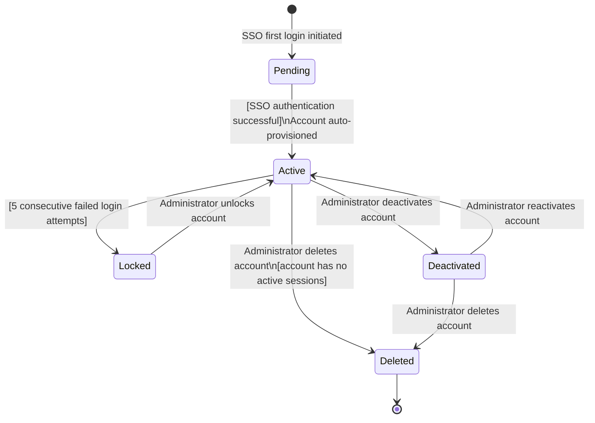
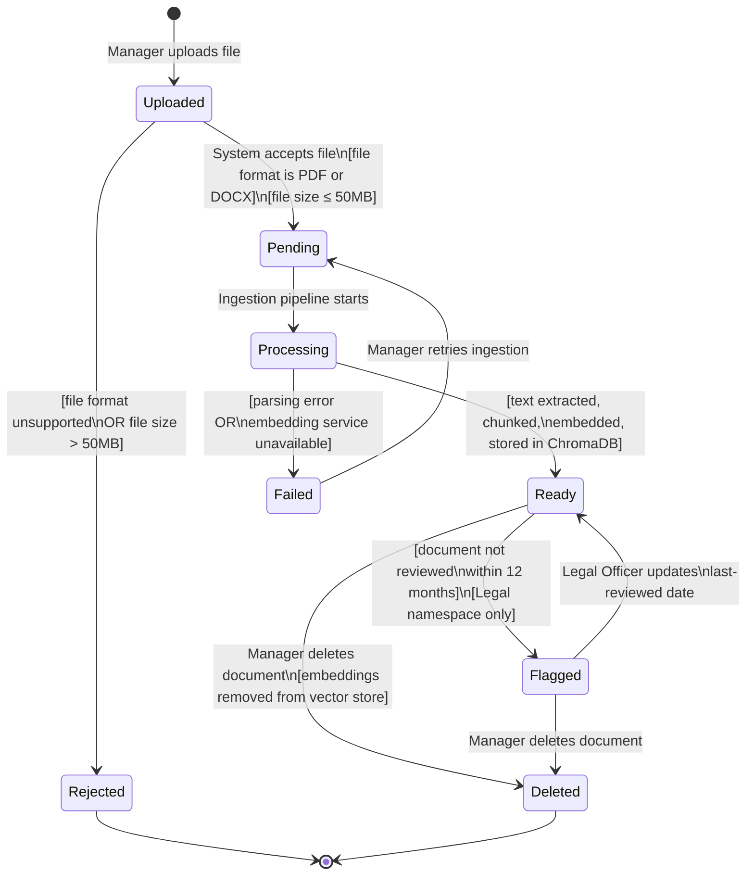
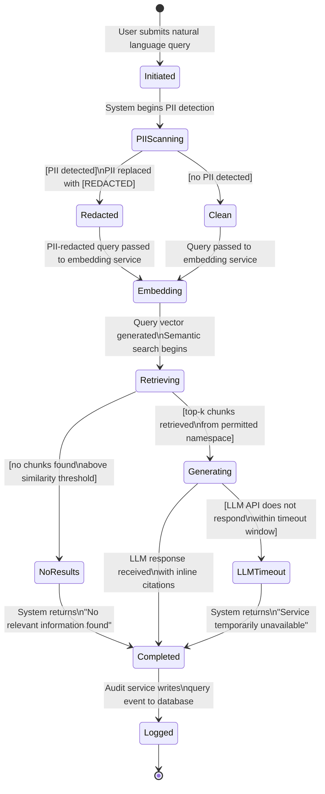
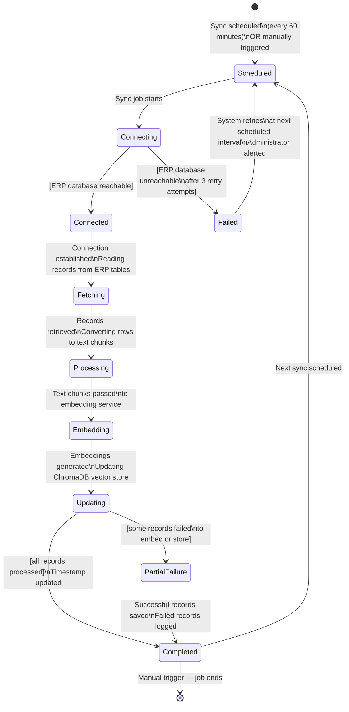
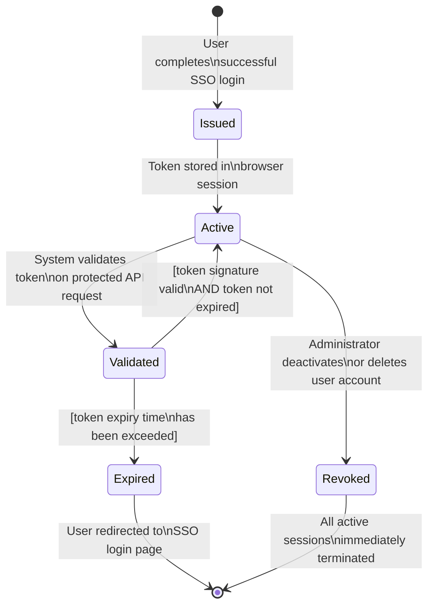
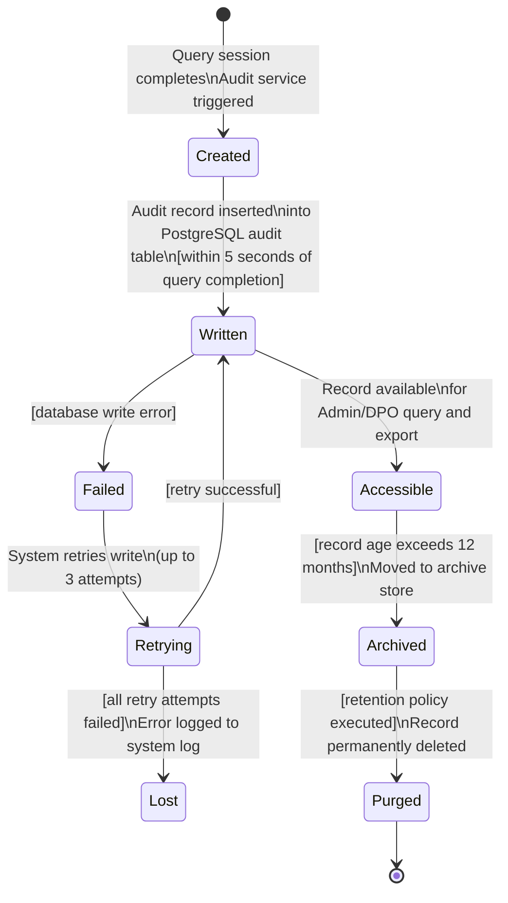
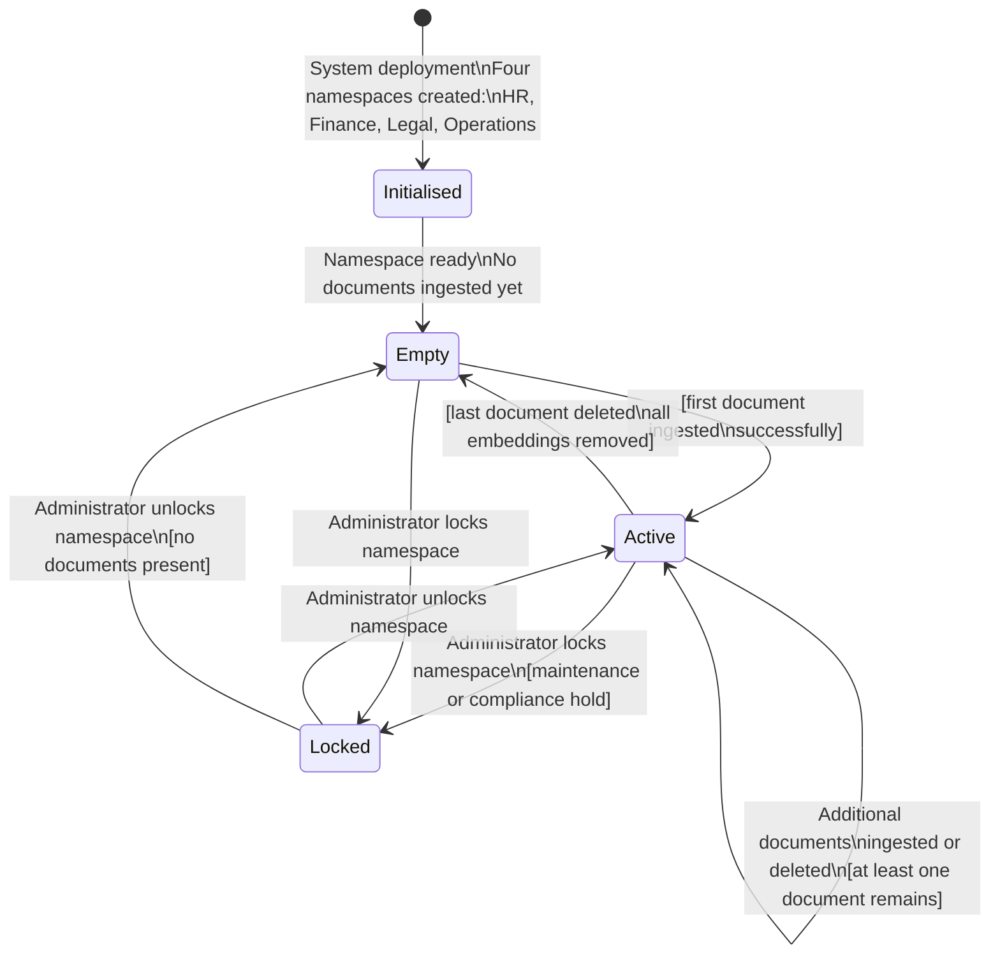
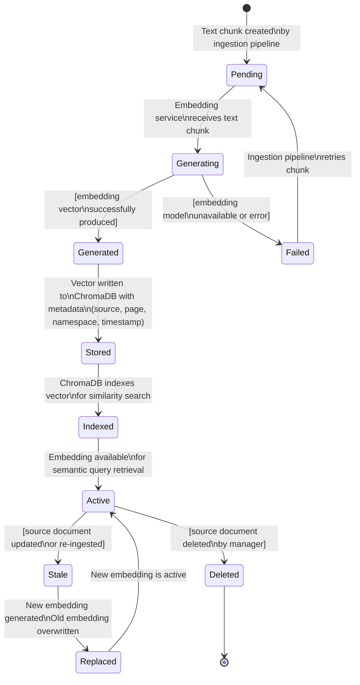

# state_diagrams.md

# EnterpriseIQ — Object State Modeling

---

## Overview

This document defines the lifecycle of 8 critical objects in EnterpriseIQ using UML state transition diagrams rendered in Mermaid. Each diagram captures the valid states an object can occupy, the events that trigger transitions between states, and guard conditions that restrict transitions. All diagrams are traceable to functional requirements in `SRD.md` and user stories in `USERSTORIES.md`.

---

## Object 1: User Account

### State Transition Diagram

### Explanation

**Key States:**
- **Pending** — The user has initiated SSO login for the first time but account provisioning is not yet complete
- **Active** — The user account is fully provisioned, role-assigned, and able to access the system
- **Locked** — The account has been automatically locked after 5 consecutive failed authentication attempts
- **Deactivated** — An administrator has suspended the account; the user cannot log in but their data is retained
- **Deleted** — The account and all associated session data have been permanently removed

**Key Transitions:**
- Pending → Active is guarded by a successful SSO authentication response; if SSO fails the account remains Pending
- Active → Locked is triggered automatically by the system after 5 failed login attempts without administrator intervention
- Locked → Active requires an explicit administrator action, preventing self-service unlocking

**Traceability:**
- Maps to **FR-01** (SSO authentication), **FR-02** (role management), **US-001** (SSO login), **US-002** (admin manages user accounts)

---

## Object 2: Document

### State Transition Diagram

### Explanation

**Key States:**
- **Uploaded** — The file has been received by the system but not yet validated
- **Pending** — File has passed validation and is queued for ingestion
- **Rejected** — File failed format or size validation and cannot be ingested
- **Processing** — The ingestion pipeline is actively parsing, chunking, and embedding the document
- **Ready** — Document is fully indexed in ChromaDB and queryable by authorised users
- **Failed** — Ingestion encountered an error; the document is not queryable
- **Flagged** — Document in the Legal namespace has exceeded the 12-month review threshold
- **Deleted** — Document and all associated embeddings have been permanently removed

**Key Transitions:**
- Uploaded → Pending is guarded by format (PDF/DOCX) and size (≤50MB) checks
- Processing → Failed triggers an error notification to the manager
- Ready → Flagged only applies to the Legal namespace and is driven by the scheduled daily expiry check

**Traceability:**
- Maps to **FR-03** (document upload), **FR-07** (document expiry flagging), **US-003** (upload documents), **US-007** (flag expired documents)

---

## Object 3: Query Session

### State Transition Diagram

### Explanation

**Key States:**
- **Initiated** — User has submitted a query; processing begins
- **PIIScanning** — The redaction module scans the query text for personal identifiable information
- **Redacted / Clean** — Query either had PII replaced or passed through clean
- **Embedding** — The (redacted) query is being converted to a vector
- **Retrieving** — Semantic similarity search is running against ChromaDB
- **NoResults** — Search returned no relevant chunks above the similarity threshold
- **Generating** — LLM is generating a response from the retrieved context
- **LLMTimeout** — The LLM API did not respond within the allowed window
- **Completed** — A response (or safe fallback message) has been returned to the user
- **Logged** — The full query event has been written to the audit trail

**Traceability:**
- Maps to **FR-05** (natural language query), **FR-09** (audit logging), **FR-12** (PII redaction), **US-004** (submit query), **US-009** (PII redaction)

---

## Object 4: ERP Sync Job

### State Transition Diagram

### Explanation

**Key States:**
- **Scheduled** — Sync is queued for the next interval or awaiting manual trigger
- **Connecting** — System is attempting to establish a connection to the ERP PostgreSQL database
- **Connected** — Connection is established and records are being read
- **Fetching / Processing / Embedding / Updating** — Pipeline stages converting ERP records to searchable vectors
- **Completed** — Sync finished successfully with timestamp updated
- **Failed** — ERP was unreachable; previous embeddings remain; administrator alerted
- **PartialFailure** — Some records processed successfully; failures logged for review

**Traceability:**
- Maps to **FR-04** (structured database sync), **US-006** (Finance Officer queries live ERP data)

---

## Object 5: JWT Authentication Token

### State Transition Diagram

### Explanation

**Key States:**
- **Issued** — Token generated immediately after successful SSO authentication
- **Active** — Token is live in the user's browser session and valid for API requests
- **Validated** — Token is being checked on each protected API request
- **Expired** — Token has passed its expiry time; user must re-authenticate
- **Revoked** — Administrator action has immediately invalidated the token

**Key Transitions:**
- Validated → Active (on success) or Expired (on timeout) is a guard condition checked on every API call
- Active → Revoked can happen at any time via administrator action, immediately terminating the session

**Traceability:**
- Maps to **FR-01** (authentication), **NFR-03** (security), **US-001** (SSO login), **US-002** (admin manages users)

---

## Object 6: Audit Log Entry

### State Transition Diagram

### Explanation

**Key States:**
- **Created** — The audit event object exists in memory after a query completes
- **Written** — Successfully persisted to the PostgreSQL audit table
- **Failed / Retrying** — Database write failed; system retries up to 3 times
- **Lost** — All retries failed; the event is unrecoverable (logged as a system error)
- **Accessible** — Record is queryable and exportable by Admin/DPO
- **Archived** — Record has exceeded 12 months and been moved to long-term storage
- **Purged** — Record has been permanently deleted per the data retention policy

**Traceability:**
- Maps to **FR-09** (audit logging), **NFR-09** (data retention), **US-008** (admin views audit log)

---

## Object 7: Namespace

### State Transition Diagram

### Explanation

**Key States:**
- **Initialised** — Namespace collection created in ChromaDB at system startup
- **Empty** — Namespace exists but contains no document embeddings; queries return no results
- **Active** — Namespace contains at least one ingested document and is queryable
- **Locked** — Namespace has been suspended by an administrator; no queries or ingestion permitted

**Traceability:**
- Maps to **FR-13** (department namespaces), **FR-14** (namespace access control), **US-003** (upload documents)

---

## Object 8: Vector Embedding

### State Transition Diagram

### Explanation

**Key States:**
- **Pending** — Text chunk is queued for embedding generation
- **Generating** — The HuggingFace SentenceTransformer model is processing the chunk
- **Generated** — The vector has been produced and is ready for storage
- **Failed** — Embedding generation failed; chunk will be retried
- **Stored** — Vector written to ChromaDB with full metadata
- **Indexed** — ChromaDB has indexed the vector for ANN search
- **Active** — Embedding is live and retrievable during semantic search
- **Stale** — The source document has been updated; this embedding is outdated
- **Replaced** — The stale embedding has been overwritten by a new one
- **Deleted** — Embedding has been removed because the source document was deleted

**Traceability:**
- Maps to **FR-03** (document ingestion), **FR-05** (RAG query), **US-003** (upload documents), **US-004** (submit query)
